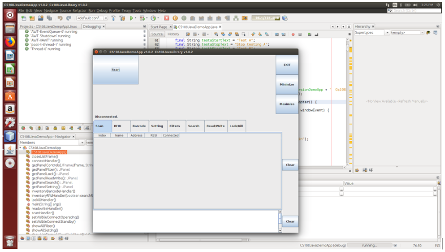

# CslCs108LinuxJavaApp
CS108 Linux Java Bluetooth Demo App and SDK

This application provides demonstrations to the programming interface made available on the CS108 handheld reader for configuring, controlling, and accessing the RFID reader. The development was based on the CS108 Java API for the Ubuntu Linux desktop.

[Product Information](https://www.convergence.com.hk/cs108/)
<br>

## Pre-requsite 

The development environment consists of the following:
- Ubuntu version 16.04 (this is the recommended version that has been validated.  Other distributions should also work)
- NetBean IDE 8.1 or later
- BlueZ v5.45 or later

## Setting Up the Environment

You can copy the packet content to a local folder such as [CS108-Linux-Java-Demo-Build-x.x.x].  Within the package, there should be two sub-folders:

*CS108JavaLibrary_170811_VX.X.X*
- Contains the source code of the custom library for accessing the CS108 device.

*CS108JavaDemoApp_170811_VX.X.X*
- Contains the source code of the demo application with user interface built with Java Swing class library.	

You will also need JDK 8.  First, open a terminal, add Oracle’s PPA then update your package repository:

```bash
$ sudo add-apt-repository ppa:webupd8team/java
$ sudo apt-get update
```

To install Oracle JDK8, enter the following command:

```bash
$ sudo apt-get install oracle-java8-installer
```

After installing JDK8, you can confirm the location where Java is installed by the following command:

```bash
$ sudo update-alternatives –config javac
```

You should see the path where the Java compiler is located.  In this case, Java path should be /usr/lib/jvm/java-8-oracle

You can now download NetBean IDE for Java SE from [NetBeans](https://netbeans.org/downloads).  The installer should be a .sh file to be executed.

You can navigate to the folder of the sh file and execute by:

```bash
$ ./netbeans-8.2-javase-linux.sh
```

The installer will check your Java runtime and if any previous installation on the system.  If everything is okay, the installation wizard will be launched.

Provide the installation path and also the location of the JDK that we have obtained earlier.

</img>

The wizard will then bring you to the installation process and get NetBeans installed.  You will also need the Bluetooth protocol stack – BlueZ installed on the machine.  You can do that with the following command:

```bash
$ sudo apt-get install bluez
```
You can also get Bluetooth Manager for Bluetooth device management with the following command:
```bash
$ sudo apt-get install blueman
```

After that, you can launch NetBeans and select File->Open Project.  Navigate to the folder the demo app is located and select Open Project


<br>

You can now build and debug the CS108JavaDemoApp project, along with further customizations.  Please refer to the CS108 Bluetooth Linux Java API Specifications for further details.


